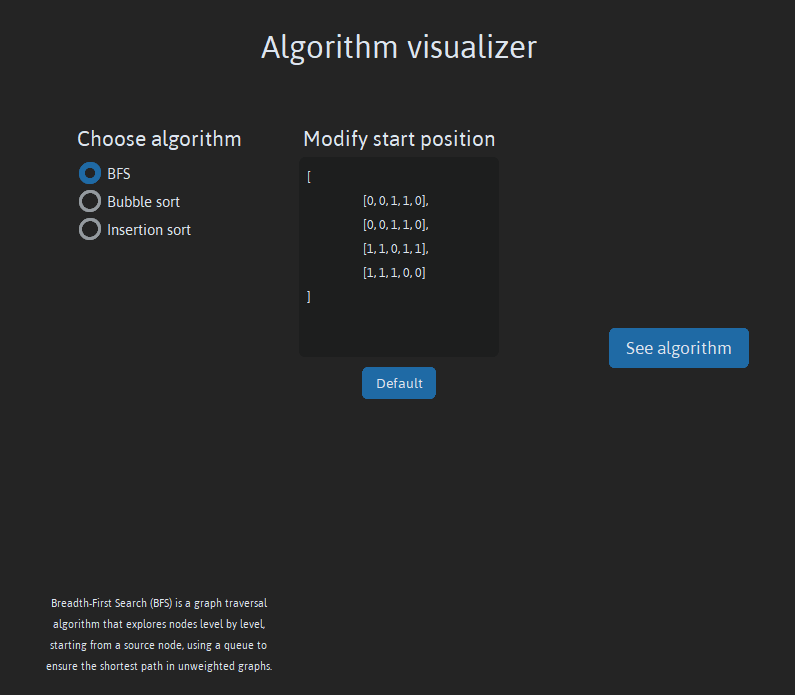
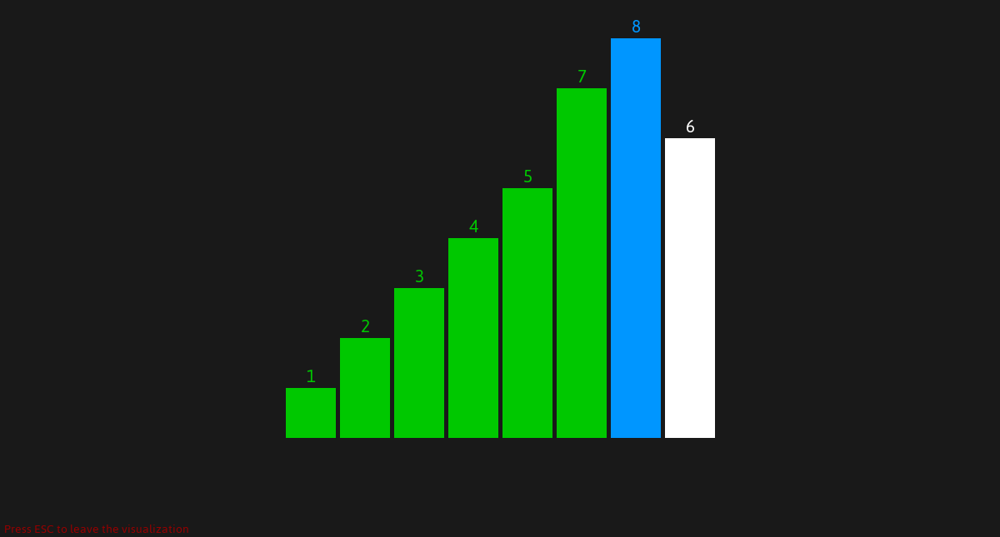

# **Algorithm Visualizer**
A Python application that shows how common algorithms work. This includes *(or will include in the future)* algorithms of binary trees, graphs and more.

### **Prerequisites**
All of the prerequisites are needed **only if you choose to download the projects via source code**.

**Python** version 3.9+ -  [Download Python](https://www.python.org/downloads/)
**pip** version 23.0.0+ -  Use `python -m pip install --upgrade pip` after installing python to install the latest version

### **Instalation process**
#### Using source code
Clone the repository with:
`git clone https://www.github.com/GrujicFilipRS/Algorithm-Visualizer` for the **development** version
or `git clone --single-branch -b release https://www.github.com/GrujicFilipRS/Algorithm-Visualizer` for the **release** verison

Install the necessarry python modules with `pip install -r ./Algorithm-Visualizer/requirements.txt`

#### Using releases
Go onto [the releases section](https://github.com/GrujicFilipRS/Algorithm-Visualizer/releases) of the repository, and download the correct executable for your operating system

### **Usage**

Run the file using `python main.py` (if downloaded through source code) or just run the executable.

Choose what algorithm to run, choose it's starting state, and press **See algorithm**.

